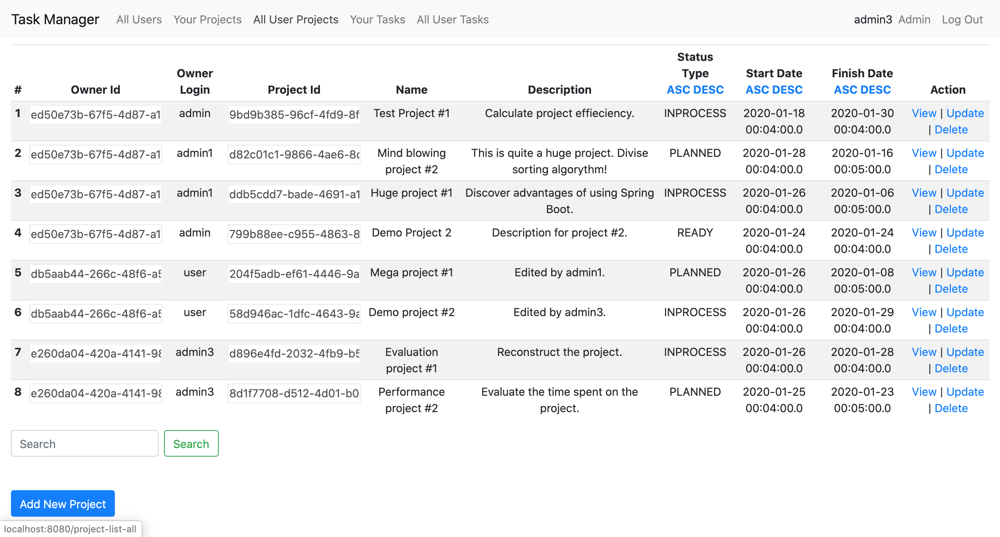
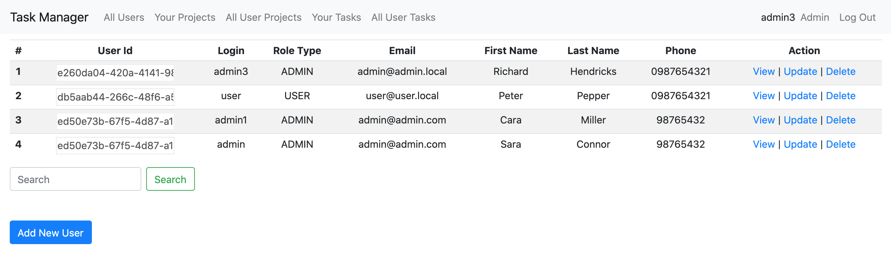
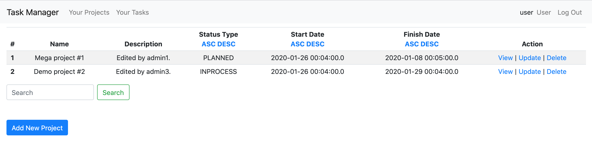

# Task Manager Application

### Project Description

The following project is meant for managing tasks by breaking projects down into specific goals.

### Software Requirements:
```
1. Java 1.8
2. Maven 3.8.0
3. Spring Boot Parent 2.2.6.RELEASE
4. Spring Boot Security 2.2.6.RELEASE
```
### Technological Stack:
```
1. Spring Boot Data JPA 2.2.6.RELEASE
2. Spring Boot Web 2.2.6.RELEASE
3. Postgresql
4. Hibernate 5.3.0.Final
5. Javax servlet 3.1.0
6. Javax servlet jsp-api 2.3.1
7. Jstl 1.2
```
### Developer Contact Information
```
Anastasia Kolevatykh
anastasia.kolevatykh@gmail.com
```
### Command for Application Building:
```
mvn clean install
```
### Command for Application Running:
```
spring-boot:run
```

#### Admin page example
The list of all projects is available for admins only.


Users' list is available for admin access only.


#### User page example
